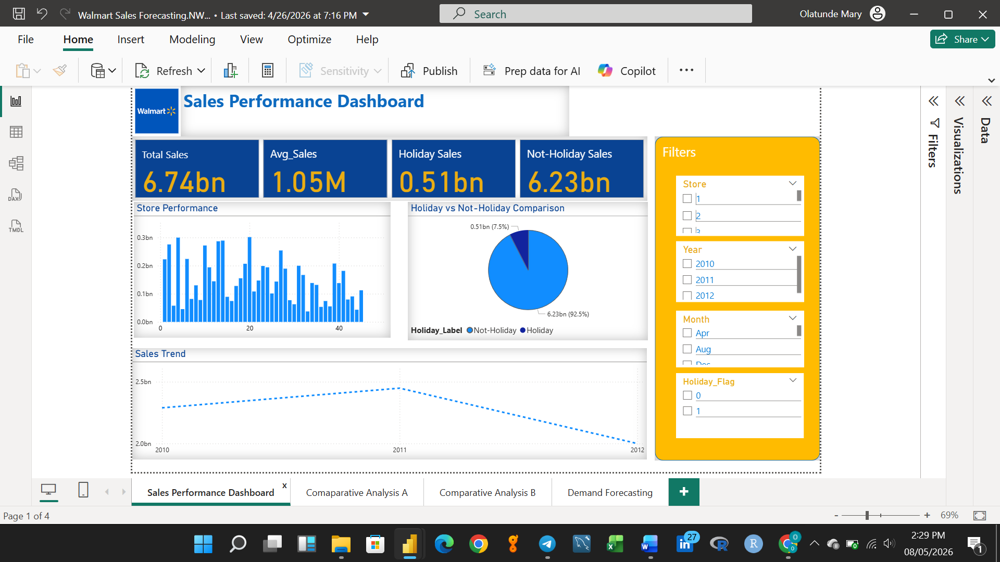

# 📊 WALMART SALES PERFORMANCE ANALYSIS & DEMAND FORECASTING (2010–2012)

This project analyzes Walmart weekly sales performance across 45 stores using historical sales data (2010–2012). The analysis focuses on store-level sales trends, holiday vs non-holiday sales performance, external factors affecting demand, and forecasting future weekly sales using Power BI.

🔗 [Download Dataset](https://github.com/Menorah-Tee/Walmart-Sales-Forecasting/blob/main/Walmart.csv)

##  Project Summary

Sales performance monitoring and demand forecasting are critical in retail because they support better inventory planning, staffing decisions, and improved customer satisfaction. This Power BI project provides insights into:

- Weekly sales trends across multiple stores  
- Top and bottom performing stores  
- Holiday vs non-holiday sales patterns  
- Relationship between sales and external factors (Temperature, Fuel Price, CPI, Unemployment)  
- Future sales forecasting using historical patterns  

## 📌 Executive Summary
Walmart sales performance was analyzed using weekly sales data from 2010 to 2012 across 45 stores. The analysis revealed significant variation in store performance, with a small number of stores contributing a large portion of total revenue. Holiday periods showed noticeable spikes in sales, indicating increased consumer demand during festive periods.
External factor analysis (Temperature, Fuel Price, CPI, and Unemployment) showed weak to moderate influence on weekly sales, suggesting that store-level operational factors and seasonal demand trends play a stronger role in sales performance.
A forecasting model was implemented in Power BI to predict future weekly sales trends, supporting improved demand planning and proactive business decision-making.

## 🏭 Industry Context

The Retail Industry thrives on:
- Accurate demand planning and forecasting  
- Inventory availability and supply chain efficiency  
- Customer satisfaction through consistent product availability  
- Store performance monitoring and operational optimization  
- Data-driven decision-making for growth and profitability  

## 🧮 Key Business Metrics

| Metric                  | Value         |
|-------------------------|--------------|
| Total Stores Analyzed   | 45           |
| Time Period Covered     | 2010–2012    |
| Total Weekly Sales      | $6.74B       |
| Average Weekly Sales    | $1.05M       |
| Forecast Period         | 12 Weeks     |
| Holiday Sales Indicator | HolidayFlag  |

## 🔍 Key Insights & Findings

### 1. *Weekly Sales Trend*
- Weekly sales fluctuated across the years, showing clear seasonal spikes.
- Major peaks were observed around holiday periods.

### 2. *Top Performing Stores*
- The top-ranked stores contributed significantly to total sales.
- A small number of stores consistently maintained strong weekly performance.

### 3. *Bottom Performing Stores*
- Some stores recorded consistently lower weekly sales.
- Performance gaps highlight the need for deeper store-level operational assessment.

### 4. *Holiday vs Non-Holiday Performance*
- Holiday periods recorded noticeable increases in weekly sales.
- Non-holiday sales still accounted for the largest share of overall revenue.

### 5. *External Factors vs Weekly Sales*
Scatter plot analysis showed:
- Temperature had weak influence on sales.
- Fuel price and CPI showed mild relationships with weekly sales.
- Unemployment rate showed limited correlation with sales performance.

## 📈 Demand Forecasting

Power BI forecasting was applied to predict future weekly sales trends using historical data patterns.

The forecast results provided:
- Expected future sales movement
- Trend continuation based on historical performance
- Confidence intervals to show prediction uncertainty

## 📌 Dashboards Included

### 📍 1. Sales Performance Dashboard

### 📍 2. Comparative Analysis Dashboard
Highlights top/bottom performing stores and store ranking based on total sales.

---

### 📍 3. External Factors Dashboard
Shows relationships between sales and economic indicators using scatter plots.

---

### 📍 4. Forecasting Dashboard
Presents predicted future weekly sales trends using Power BI forecasting.

---

## 📌 Tools & Technologies Used

- Power BI – Data Cleaning (Power Query), Data Modeling, DAX, Forecasting, Interactive Dashboards  
- Excel – Dataset formatting and initial review  

---

## 📁 Project Files

📂 [Power BI File (.pbix)](#) *(Add your Power BI file link)*  
📂 [Dataset File](#) *(Add your dataset link)*  
📂 [Dashboard Screenshots](images/)  

---

## 👋 Connect With Me

Let’s connect and talk Data Analytics & Business Intelligence:

- 💼 LinkedIn: [LinkedIn ](https://www.linkedin.com/in/tomisin-olatunde-30155a2ab)
- 📧 Email: [Email me](tomisinmaryo@gmail.com)

---

⭐ If you found this project interesting, feel free to star this repository!
Tracks weekly sales trends and key sales KPIs across all stores.

